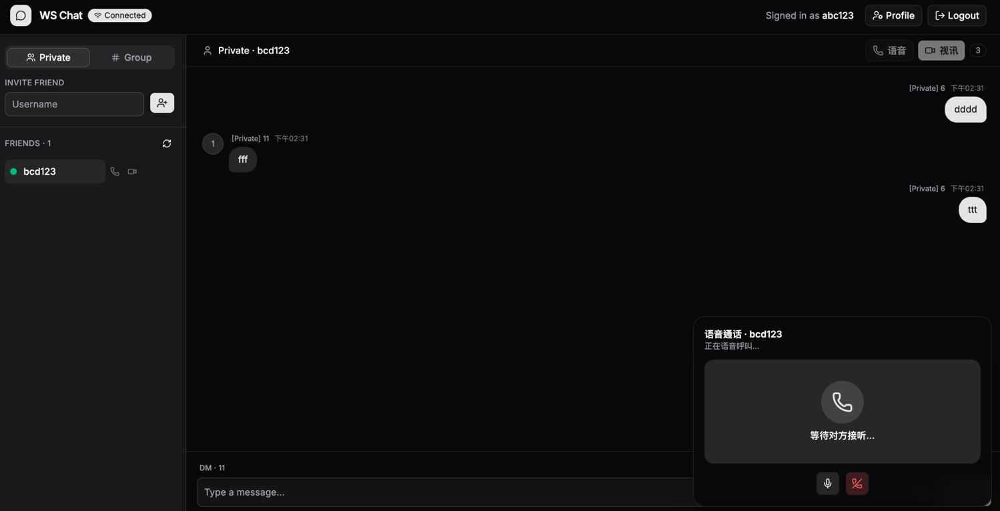
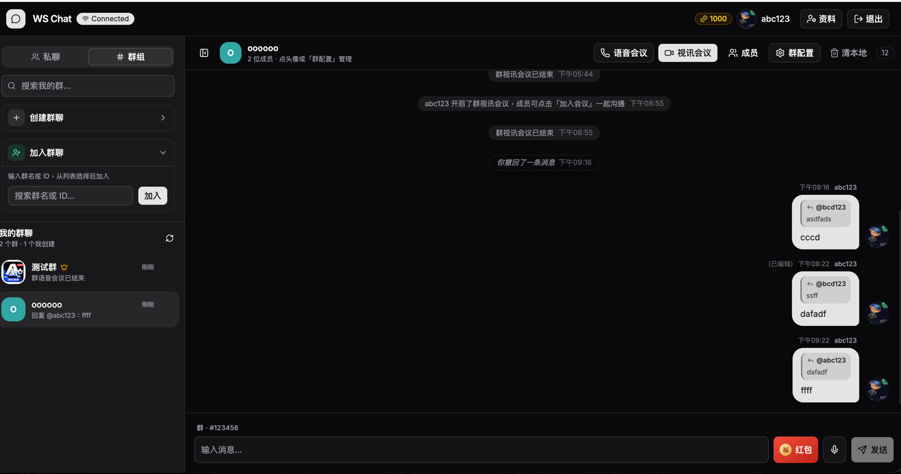

# ws-ex

Realtime chat monorepo: **Go** backend (`chat-service`) + **SvelteKit** frontend (`front-chat`), with **NATS JetStream**, **Postgres**, and **LiveKit** for voice/video.

☕ **Buy me a coffee (TRON TRC-20):** `TKtVr7WgH4UnyNPTJULbna7kK1LMCqTapZ`




## Buy me a coffee ☕

If this project helps you, a coffee is always welcome.

| | |
|---|---|
| **Network** | TRON (TRC-20) |
| **Asset** | USDT / TRX |
| **Address** | `TKtVr7WgH4UnyNPTJULbna7kK1LMCqTapZ` |

```text
TKtVr7WgH4UnyNPTJULbna7kK1LMCqTapZ
```

The same address is available in the UI (login page + chat header coffee icon).

---

## Repository layout

```
ws-ex/
├── chat-service/        # Go WebSocket + REST API (module: ws-ex)
├── front-chat/          # SvelteKit static UI + nginx reverse proxy
├── docker-compose.yml   # nats · postgres · livekit · ws-server · frontend
├── livekit.yaml         # LiveKit SFU config
└── screen/              # Screenshots
```

| Path | Stack | Default port |
|------|--------|--------------|
| `chat-service/` | Go · Gin · NATS · Postgres · LiveKit tokens | `:8080` |
| `front-chat/` | SvelteKit (static) + nginx | `:3000` → proxies `/api`, `/ws` |
| NATS JetStream | Messaging + history streams | `:4222` |
| Postgres | Users, groups, friends, wallets, message meta | `:5432` |
| LiveKit | WebRTC SFU (private call + group meeting) | signaling via proxy |

---

## Architecture

### High-level

```
┌─────────────┐     HTTPS / WS      ┌──────────────────┐
│  Browser    │◄───────────────────►│  nginx (frontend)│
│  Svelte UI  │                     └────────┬─────────┘
└──────┬──────┘                              │ /api  /ws  /rtc
       │                                     ▼
       │ WebRTC media              ┌──────────────────┐
       └──────────────────────────►│  LiveKit SFU     │
                                   └──────────────────┘
                                             ▲
                                   token/API │
                                   ┌─────────┴────────┐
                                   │  chat-service    │
                                   │  (Go / Gin)      │
                                   └───┬──────────┬───┘
                       JetStream + KV  │          │ SQL
                                       ▼          ▼
                                   ┌──────┐  ┌─────────┐
                                   │ NATS │  │ Postgres│
                                   └──────┘  └─────────┘
```

### Backend (`chat-service`)

Layered Gin app under `controller` → `service` → `model` / `dto`:

| Area | Responsibility |
|------|----------------|
| **Auth** | Register / login / JWT / profile / avatar |
| **Chat WS** | Hub of connections; private & group messages; typing; recall; edit |
| **NATS** | Publish/subscribe; JetStream history; presence KV; cross-instance events |
| **Groups** | Durable rooms: create, join, leave, dissolve, rename, avatar, roles (`owner` / `admin` / `member`) |
| **Friends** | Invite, accept, list, block |
| **Media** | Voice clips, user avatars, group icons |
| **Red packet** | Virtual wallet + group/private/designated packets |
| **LiveKit** | Token minting; private **call** (ring/accept) vs group **meeting** (join/leave) |
| **Message store** | Seq allocation, recall/edit authorization (2‑minute window) |

**Message path (simplified):**

1. Client sends WS frame (optionally AES-GCM encrypted body).
2. Server normalizes, encrypts if needed, assigns `id` + `seq`.
3. Private → deliver to peer (+ offline inbox); Group → NATS subject fan-out.
4. JetStream retains history (~180 days; clients page with `before_seq` / `since_seq`).
5. Control events (`recall`, `edit`, presence, meeting) go Core NATS `chat.event.*`.

**Roles (group):**

- **Owner** — dissolve, set admin/member roles, rename, avatar  
- **Admin** — rename, avatar (not dissolve / not role changes)  
- **Member** — chat, leave  

### Frontend (`front-chat`)

| Area | Notes |
|------|--------|
| **Svelte 5** | Controllers in `chat.svelte.ts` / `call.svelte.ts` |
| **REST** | `$lib/api/*` domain services |
| **WS** | Realtime chat + presence + call/meeting signals |
| **Crypto** | Message body AES-GCM; key via `/api/crypto/key` |
| **UI** | shadcn-svelte components; toasts + confirm/alert dialogs |
| **Local cache** | `localStorage` history cache + scroll-up older pages |

**UX highlights:** private DM vs group chat; right-click message → reply / edit / recall; group settings (name, icon, roles, dissolve); private call vs group meeting.

### Docker stack

```bash
docker compose up -d --build
```

| Service | Role |
|---------|------|
| `nats` | JetStream + monitoring `:8222` |
| `postgres` | Durable app data |
| `livekit` | SFU; set `LIVEKIT_NODE_IP` for LAN ICE |
| `ws-server` | Go API + WS |
| `frontend` | nginx static + reverse proxy |

---

## Quick start

### Docker (recommended)

```bash
# from repo root
docker compose up -d --build
```

- **UI:** http://localhost:3000  
- **API / WS:** http://localhost:8080  

LAN clients (LiveKit media): export host LAN IP before up:

```bash
export LIVEKIT_NODE_IP=192.168.x.x
docker compose up -d
```

### Local development

**Backend**

```bash
cd chat-service
# from repo root: docker compose up -d nats postgres livekit
go run ./cmd/server          # one-shot
# make dev                  # hot reload (air)
```

**Frontend**

```bash
cd front-chat
pnpm install
pnpm dev
```

Point `VITE_API_BASE` / Vite proxy at the Go server if not using the nginx image.

---

## Feature map

| Feature | Description |
|---------|-------------|
| Private chat | 1:1 DM, history, typing, recall/edit (2 min) |
| Group chat | Durable members, roles, avatar, settings |
| Reply | Right-click message → reply with quote |
| Voice | Record & send voice clips |
| Red packet | Virtual coins, group / private / designated |
| Private call | Ring + accept, LiveKit audio/video |
| Group meeting | Open room; members join freely |
| Presence | Online/offline via hub + KV |

---

## License

See [LICENSE](LICENSE).
